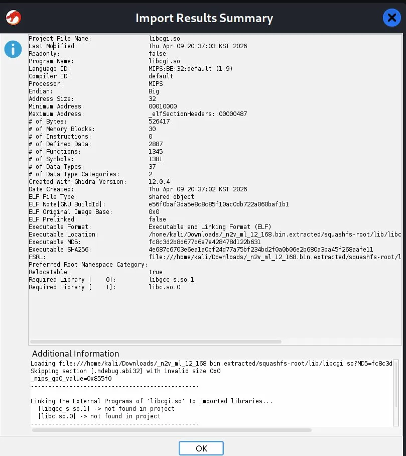
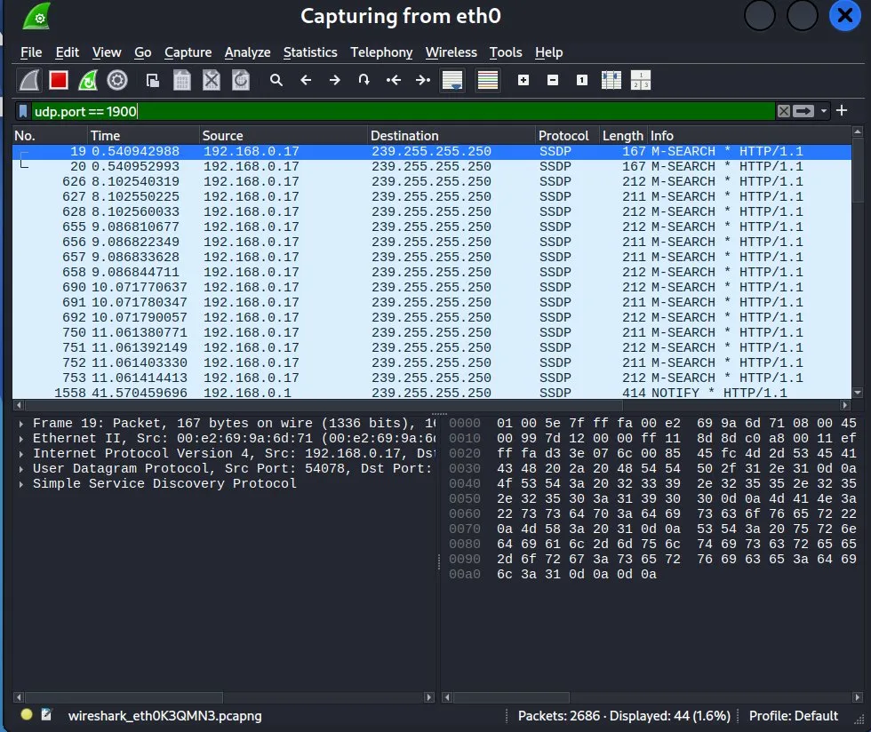
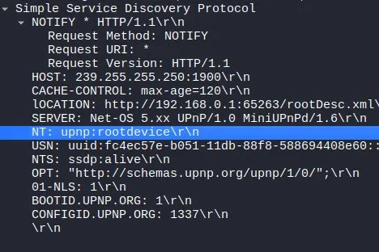
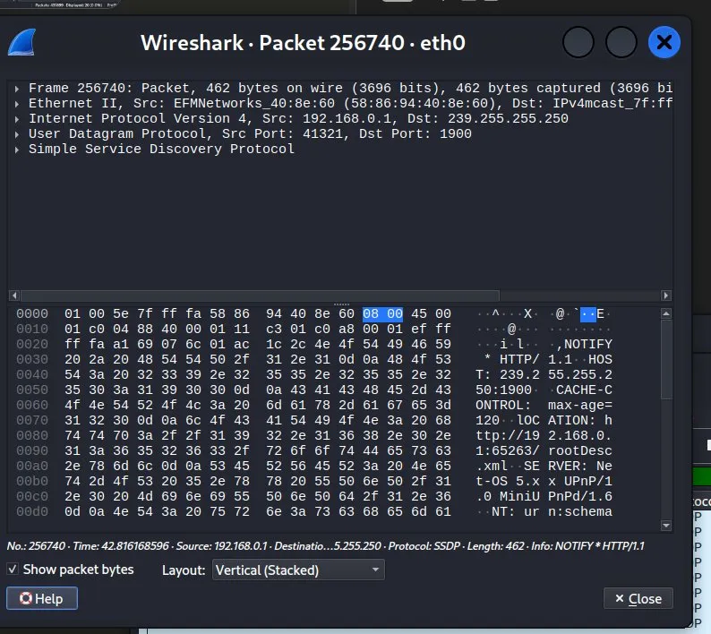
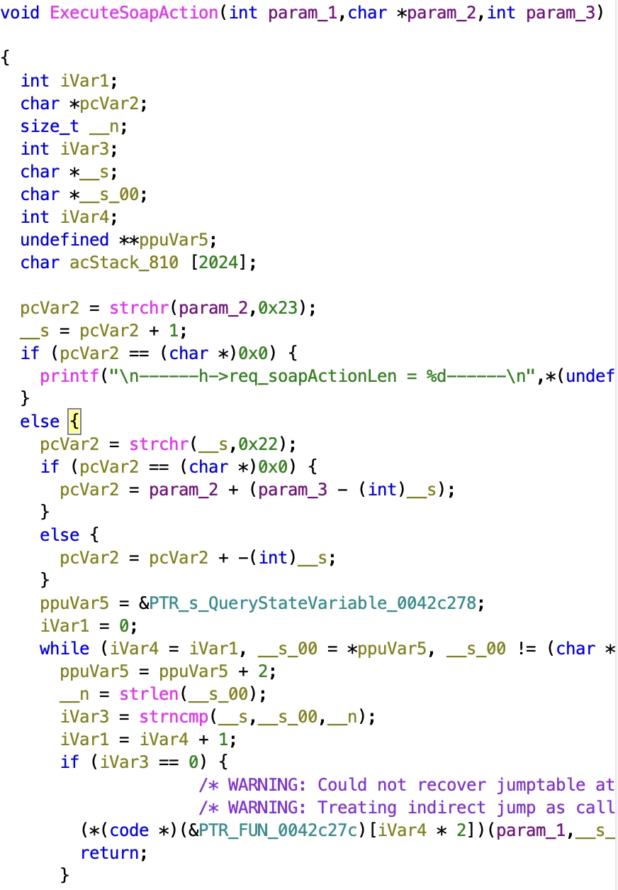
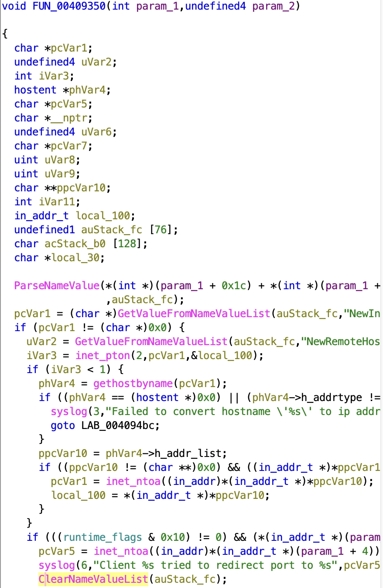
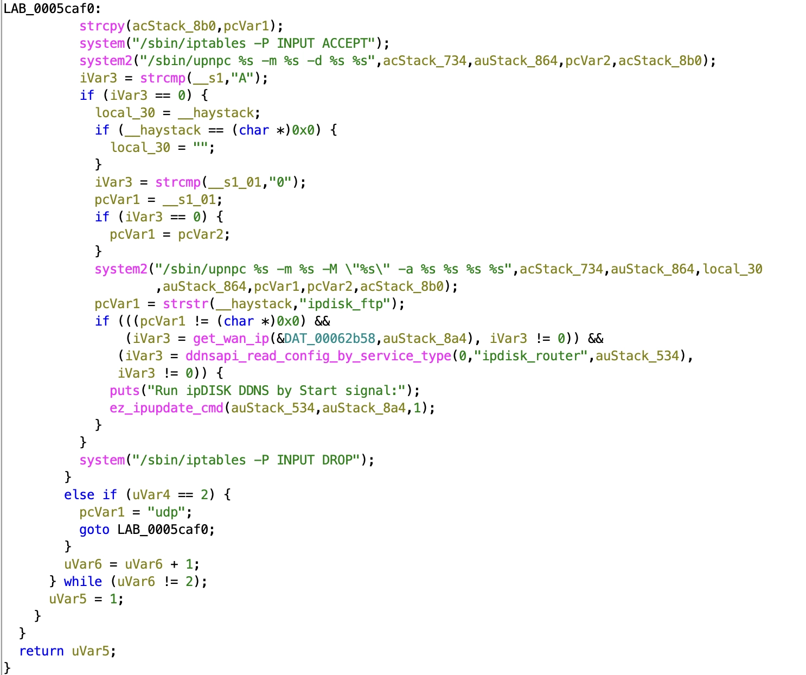

# [제 1차 프로젝트 진행 보고서] GhostRelay

- **팀원:** (팀장) 20233051_박도현, (팀원) 20253311_강수빈, 20261717_이정훈, 20241947_장수연
- **활동 기간:** 2026. 03. 28. ~ 2026. 05. 05. (약 6주)

## 팀 전체 진행 현황

- **이번 회차 목표:** 분석 환경 세팅 완료, 펌웨어 추출 및 libcgi.so 위치 확인, UPnP 네트워크 트래픽 캡처, PoC 공격 흐름 파악, Ghidra를 이용한 취약 함수 코드 레벨 분석
- **현재 진행률:** 40% (전체 일정 대비)
- **주요 달성 사항:**
  - Kali Linux VM 환경 구축 및 분석 도구(binwalk, Wireshark, Ghidra) 세팅 완료
  - binwalk로 N2V 펌웨어(12.16.8) 파일시스템 추출 성공, `libcgi.so` 위치 확인
  - Wireshark로 UPnP SSDP 트래픽 캡처, `rootDesc.xml`에서 `controlURL: /ctl/IPConn` 확인
  - Ghidra(v12.0.4)로 `libcgi.so` 정적 분석 완료
  - `ExecuteSoapAction()`, `AddPortMapping` 처리 함수, `upnp_relay()`의 명령 실행 지점 확인
  - 취약점 데이터 흐름(외부 입력 -> UPnP 처리 로직 -> `/sbin/upnpc` 명령 구성 -> `system2()` 실행) 추적 완료
  - CVE-2025-55423 PoC 3단계 공격 흐름과 디컴파일 코드 대조 완료
  - 패치 방향 확인: `system()` 계열 호출을 `execvpe()` / `execvp()` 기반 실행 방식으로 교체

## 개인별 기여 내역

| 팀원 | 역할 | 수행 작업 | 산출물 링크 | 기여도 |
|------|------|----------|------------|--------|
| 20233051_박도현 | 리버스 엔지니어링 / 네트워크 분석 / 팀장 | Kali VM 세팅, binwalk 펌웨어 추출, Wireshark UPnP 캡처, controlURL 확인, PoC 흐름 분석, Ghidra 코드 분석 | [PR #13](https://github.com/ssu-asc/ProjectDB/pull/13) | 25% |
| 20253311_강수빈 | Web & AI 보안 엔지니어링 | Kali VM 세팅, binwalk 펌웨어 추출, Wireshark UPnP 캡처, controlURL 확인, PoC 흐름 분석 | - | 25% |
| 20261717_이정훈 | 리버스 엔지니어링 | Ghidra 정적 분석, upnp_relay() 취약 함수 확인, AddPortMapping SOAP 처리 구조 분석 | - | 25% |
| 20241947_장수연 | 리버스 엔지니어링 | Ghidra 정적 분석, upnp_relay() 취약 함수 확인, AddPortMapping SOAP 처리 구조 분석 | - | 25% |

## 이번 회차 상세 분석 내용

### 1. 펌웨어 추출 및 환경 세팅

binwalk를 이용해 N2V 펌웨어(`n2v_ml_12_168.bin`)를 추출하였다. 추출 결과 Squashfs 파일시스템이 확인되었으며, 핵심 분석 대상인 `libcgi.so`의 위치를 확인하였다.

```text
/squashfs-root/lib/libcgi.so
ELF 32-bit MSB shared object, MIPS, MIPS-II version 1 (MIPS), stripped
```

Ghidra Import Results에서 확인된 주요 메타데이터는 다음과 같다.

| 항목 | 값 |
|------|-----|
| Language | MIPS:BE:32 (Big Endian) |
| # of Functions | 1345 |
| # of Symbols | 1381 |
| Required Libraries | libgcc_s.so.1, libc.so.0 |



### 2. UPnP 네트워크 트래픽 분석

Wireshark를 이용해 UDP 포트 1900(SSDP)을 캡처하였다. 공유기(192.168.0.1)가 브로드캐스트하는 NOTIFY 패킷에서 다음 정보를 확인하였다.

| 필드 | 값 |
|------|-----|
| LOCATION | `http://192.168.0.1:65263/rootDesc.xml` |
| SERVER | `Net-OS 5.xx UPnP/1.0 MiniUPnPd/1.6` |
| controlURL | `/ctl/IPConn` |





### 3. libcgi.so 정적 분석 (Ghidra)

#### 3-1. SOAPAction 분기 구조

외부에서 전달되는 SOAPAction 문자열은 `ExecuteSoapAction()`에서 파싱된다. 함수는 `#` 이후의 action 이름을 추출한 뒤, 내부 함수 포인터 테이블과 비교하여 대응되는 처리 함수로 분기한다.



#### 3-2. AddPortMapping 입력 처리

`AddPortMapping` 요청은 내부 처리 함수(`FUN_00409350`)로 연결된다. 해당 함수에서는 SOAP Body의 name-value list를 파싱하여 `NewInternalClient`, `NewRemoteHost` 등의 값을 가져온다.

```c
ParseNameValue(..., auStack_fc);
pcVar1 = GetValueFromNameValueList(auStack_fc, "NewInternalClient");
uVar2 = GetValueFromNameValueList(auStack_fc, "NewRemoteHost");
```

이 경로는 포트포워딩 처리에 필요한 입력값을 구성하는 지점이므로, 이후 `upnp_relay()`의 명령 구성 로직과 함께 추적해야 한다.



#### 3-3. 취약 함수: upnp_relay()

`upnp_relay()` 함수에서 핵심 취약 패턴을 확인하였다. 저장된 IGD URL 및 포트포워딩 파라미터를 이용해 `/sbin/upnpc` 명령 문자열을 구성한 뒤, `system2()`에 직접 전달한다.

```c
// igd_url 값을 acStack_844에 로드
istatus_get_value_direct(&DAT_0006cd80, acStack_844);

// 검증 없이 명령어 문자열 조립
snprintf(acStack_734, 0x100, "-u %s", acStack_844);

// system2()를 통한 셸 명령 실행 -> Command Injection 지점
system2("/sbin/upnpc %s -m %s -d %s %s", acStack_734, auStack_864, pcVar2, acStack_8b0);
system2("/sbin/upnpc %s -m %s -M \"%s\" -a %s %s %s %s", acStack_734, auStack_864, ...);
```

`igd_url` 또는 포트포워딩 인자에 셸 메타문자가 포함될 경우, `system2()`가 내부적으로 `/bin/sh -c` 방식으로 실행되면서 임의 명령 실행으로 이어질 수 있다.



#### 3-4. 상위 IGD URL 오염 경로: discover_upper_upnp_igd()

`igd_url`이 어떻게 저장되는지는 `discover_upper_upnp_igd()` 함수에서 확인된다.

```c
// upnpc 실행 후 출력에서 "Found valid IGD" 라인 탐색
snprintf(acStack_1118, 0x100, "/sbin/upnpc -m %s -P", auStack_1238);
__stream = popen(acStack_1118, "r");

while (...) {
    fgets(acStack_1018, 4000, __stream);
    iVar1 = strncmp(acStack_1018, "Found valid IGD", 0xf);
}

// http로 시작하는 문자열 추출 -> URL 형식 검증 없음
pcVar3 = strstr(acStack_1018, "http");
snprintf(acStack_1218, 0x100, "%s", pcVar3);

// 검증 없이 igd_url에 저장
istatus_set_value_direct(&DAT_0006cd80, acStack_1218);
```

공격자가 가짜 UPnP 서버를 통해 `"Found valid IGD http://attacker/;reboot"` 형태의 응답을 보내면, `strstr()` 이후의 URL 문자열 전체가 `igd_url`에 그대로 저장된다. 이 값이 이후 `upnp_relay()`에서 `system2()`에 전달되어 명령 실행으로 이어질 수 있다.

### 4. PoC 공격 흐름 및 코드 대조

CVE-2025-55423 PoC의 3단계 공격 흐름을 디컴파일 코드와 대조하였다.

| PoC 단계 | 코드 대응 지점 |
|----------|--------------|
| Phase 1: 가짜 UPnP 서버 구성 | `discover_upper_upnp_igd()` -> `popen("/sbin/upnpc -m %s -P")` 실행 시 공격자 서버 응답 |
| Phase 2: ARP 스푸핑 + DHCP ACK 조작 | `get_wan_ip()` / `get_wan_link()` 결과가 공격자 쪽으로 향하도록 게이트웨이 변조 |
| Phase 3: UPnP 클라이언트 재시작 유도 | `upnp_relay()` 트리거 조건 충족 -> `system2()`로 악성 명령 실행 |

전체 공격 체인을 정리하면 다음과 같다.

```text
Phase 2: DHCP 조작
    -> get_wan_ip() 결과가 공격자 쪽으로 라우팅됨
Phase 1: 가짜 UPnP 서버 응답
    -> discover_upper_upnp_igd()가 "Found valid IGD http://attacker/;reboot" 수신
    -> igd_url에 악성 URL 저장
Phase 3: UPnP AddPortMapping 이벤트 발생
    -> upnp_relay() 호출
    -> system2("/sbin/upnpc -u http://attacker/;reboot ...") 실행
    -> root 권한으로 임의 명령 실행 (RCE)
```

### 5. 패치 방향 분석

ipTIME이 비단종 제품군에 적용한 패치 방향을 분석하였다. 핵심은 `system()` 계열 함수를 `execvpe()` / `execvp()`로 교체하는 것이다.

| 구분 | 방식 | 셸 메타문자 처리 |
|------|------|----------------|
| 패치 전 (`system2()`) | 내부적으로 `/bin/sh -c "명령어"` 실행 | 해석됨, Command Injection 가능 |
| 패치 후 (`execvpe()`) | 셸을 거치지 않고 직접 프로세스 실행 | 해석 안 됨, 메타문자 무효화 |

추가적으로 `discover_upper_upnp_igd()`의 `istatus_set_value_direct()` 호출 전에 URL 형식 검증 로직을 삽입하는 방식도 패치 후보로 검토 중이다.

## 이슈 및 해결 방안

| 이슈 | 해결 방법 |
|------|----------|
| Wireshark 캡처 필터 / 디스플레이 필터 문법 혼동 | 디스플레이 필터 `udp.port == 1900` 사용으로 해결 |
| Ghidra 실행 시 `view is invalid` 에러 | Help 시스템 관련 버그로 분석 기능에 영향 없음, 무시 후 정상 사용 |

## 다음 회차 목표

- CVE PoC 코드 클론 및 구조 분석 (`ssdp_upnp_server`, `pre_script` 디렉토리)
- 패치된 모델(A604M) 펌웨어에서 `libcgi.so` 추출 후 `execvpe` 패치 패턴 코드 레벨 확인
- N2V `libcgi.so`에 패치 backport 방향 설계
- [AI 트랙] 추출된 디컴파일 C 코드를 LLM에 전달하여 Taint Analysis 자동 추적 테스트 및 수동 분석 결과와 비교

## 참고 자료

- [CVE-2025-55423 PoC (GitHub)](https://github.com/0x0xxxx/CVE/blob/main/CVE-2025-55423/README.md)
- [CVE-2025-55423 NVD 페이지](https://nvd.nist.gov/vuln/detail/CVE-2025-55423)
- [ipTIME N2V 공식 펌웨어 다운로드](https://iptime.com/iptime/?page_id=126)
- [binwalk GitHub](https://github.com/ReFirmLabs/binwalk)
- [Ghidra (NSA)](https://ghidra-sre.org)
